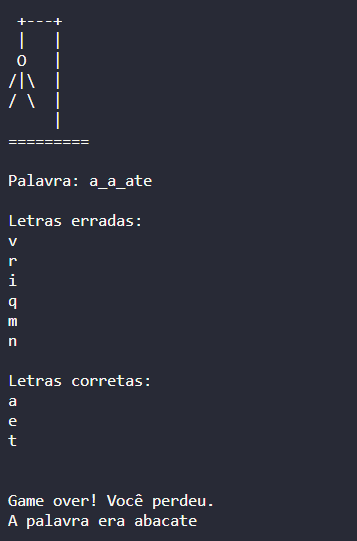

# Jogo da forca em Python

Esse programa em python é um jogo da forca no terminal.
Ele possui três diferentes versões, uma apenas utilizando '-' para representar as chances do usuário e outra representando de forma mais visual.
A terceira versão possui um código difernte, orientado a objeto, e com isso ele foi feito usando uma classe chamada Hangman com diversos métodos diferentes para a exceução do jogo.
## Screenshots

Versão 1

Versão 2

Versão 3

## Aprendizado

Esse foi meu primeiro projeto utilizando python.
Consegui aprender bastante a linguagem usando o básico dela, como sua estrutura, e manipulação de métodos e funções

Com o desenvolviemto da terceira versão, aprendi bastante sobre como funciona programação orientada a objeto

## Autor
Diogo Velozo Xavier
