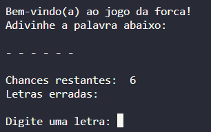
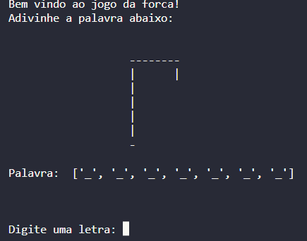

# Jogo da forca em Python

Esse programa em python é um jogo da forca no terminal.
Ele possui duas diferentes versões, uma apenas utilizando '-' para representar as chances do usuário e outra representando de forma mais visual.

## Screenshots

Versão 1

Versão 2

## Aprendizado

Esse foi meu primeiro projeto utilizando python.
Consegui aprender bastante a linguagem usando o básico dela, como sua estrutura, e manipulação de métodos e funções

## Autor
Diogo Velozo Xavier
